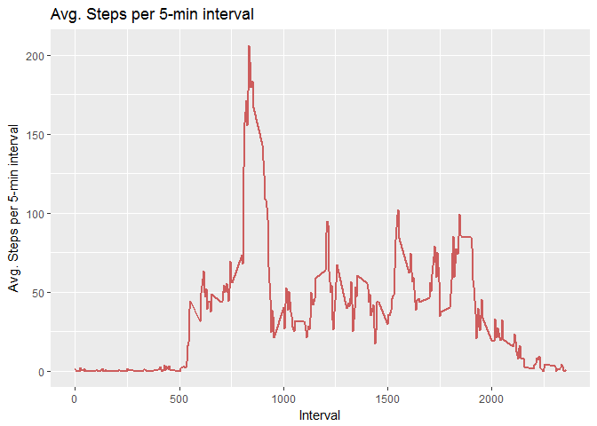
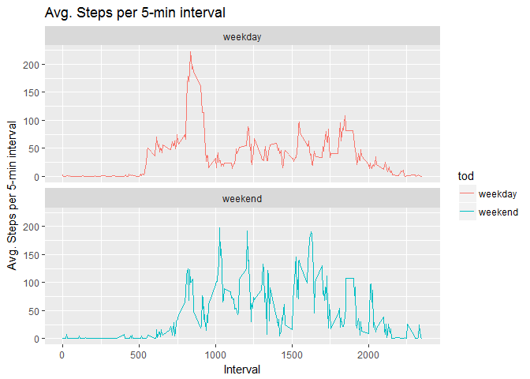

Introduction
------------

It is now possible to collect a large amount of data about personal movement using activity monitoring devices such as a [Fitbit](http://www.fitbit.com), [Nike Fuelband](http://www.nike.com/us/en_us/c/nikeplus-fuelband), or [Jawbone Up](https://jawbone.com/up). These type of devices are part of the "quantified self" movement -- a group of enthusiasts who take measurements about themselves regularly to improve their health, to find patterns in their behavior, or because they are tech geeks. But these data remain under-utilized both because the raw data are hard to obtain and there is a lack of statistical methods and software for processing and interpreting the data.

This assignment makes use of data from a personal activity monitoring device. This device collects data at 5 minute intervals through out the day. The data consists of two months of data from an anonymous individual collected during the months of October and November, 2012 and include the number of steps taken in 5 minute intervals each day.

Loading and preprocessing the data
----------------------------------

Load libraries.

``` r
library(dplyr)
```

    ## Warning: package 'dplyr' was built under R version 3.2.5

    ## 
    ## Attaching package: 'dplyr'

    ## The following objects are masked from 'package:stats':
    ## 
    ##     filter, lag

    ## The following objects are masked from 'package:base':
    ## 
    ##     intersect, setdiff, setequal, union

``` r
library(ggplot2)
```

    ## Warning: package 'ggplot2' was built under R version 3.2.5

Download and unzip data file.

``` r
zipFile = "repdata%2Fdata%2Factivity.zip"
dataFile = "activity.csv"
if (!file.exists(zipFile)){
        fileURL <- "https://d396qusza40orc.cloudfront.net/repdata%2Fdata%2Factivity.zip"
        download.file(fileURL, zipFile, method="curl")
}  
if (!file.exists(dataFile))
        unzip(zipFile)
```

Load and preprocess data.

``` r
activity <- read.csv(dataFile)
```

What is mean total number of steps taken per day?
-------------------------------------------------

1.  Calculate the total number of steps taken per day.

    ``` r
    dailySteps = activity %>%
        group_by(date) %>%
        summarise(steps = sum(steps))

    head(dailySteps, 10)
    ```

        ## # A tibble: 10 × 2
        ##          date steps
        ##        <fctr> <int>
        ## 1  2012-10-01    NA
        ## 2  2012-10-02   126
        ## 3  2012-10-03 11352
        ## 4  2012-10-04 12116
        ## 5  2012-10-05 13294
        ## 6  2012-10-06 15420
        ## 7  2012-10-07 11015
        ## 8  2012-10-08    NA
        ## 9  2012-10-09 12811
        ## 10 2012-10-10  9900

2.  Make a histogram of the total number of steps taken each day.

    ``` r
    ggplot(dailySteps, aes(x = steps)) + geom_histogram(fill = "indianred", binwidth = 1000) + labs(title = "Daily Steps", x = "Steps", y = "Frequency")
    ```

        ## Warning: Removed 8 rows containing non-finite values (stat_bin).

    

3.  Calculate and report the **mean** and **median** total number of steps taken per day.

    **mean** total number of steps taken per day

    ``` r
    mean(dailySteps$steps, na.rm=TRUE)
    ```

        ## [1] 10766.19

    **median** total number of steps taken per day

    ``` r
    median(dailySteps$steps, na.rm=TRUE)
    ```

        ## [1] 10765

What is the average daily activity pattern?
-------------------------------------------

1.  Make a time series plot (i.e. `type = "l"`) of the 5-minute interval (x-axis) and the average number of steps taken, averaged across all days (y-axis)

    ``` r
    intervalSteps = activity %>% filter(! is.na(steps)) %>%
        group_by(interval) %>%
        summarise(steps = mean(steps))

    ggplot(intervalSteps, aes(x = interval , y = steps)) + geom_line(color="indianred", size=1) + labs(title = "Avg. Steps per 5-min interval", x = "Interval", y = "Avg. Steps per 5-min interval")
    ```

    

2.  Which 5-minute interval, on average across all the days in the dataset, contains the maximum number of steps?

    ``` r
    intervalSteps$interval[which(intervalSteps$steps == max(intervalSteps$steps))[1]]
    ```

        ## [1] 835

Imputing missing values
-----------------------

1.  Calculate and report the total number of missing values in the dataset (i.e. the total number of rows with NAs)

    ``` r
    nrow(activity %>% filter(is.na(steps)))
    ```

        ## [1] 2304

2.  Devise a strategy for filling in all of the missing values in the dataset

    ``` r
    # Filling in missing values with median of dataset
    fillSteps <- median(activity$steps, na.rm=TRUE)
    fillSteps
    ```

        ## [1] 0

3.  Create a new dataset that is equal to the original dataset but with the missing data filled in.

    ``` r
    activity$steps[is.na(activity$steps)] = fillSteps
    head(activity, 10)
    ```

        ##    steps       date interval
        ## 1      0 2012-10-01        0
        ## 2      0 2012-10-01        5
        ## 3      0 2012-10-01       10
        ## 4      0 2012-10-01       15
        ## 5      0 2012-10-01       20
        ## 6      0 2012-10-01       25
        ## 7      0 2012-10-01       30
        ## 8      0 2012-10-01       35
        ## 9      0 2012-10-01       40
        ## 10     0 2012-10-01       45

4.  Make a histogram of the total number of steps taken each day and Calculate and report the mean and median total number of steps taken per day.Do these values differ from the estimates from the first part of the assignment? What is the impact of imputing missing data on the estimates of the total daily number of steps?

    ``` r
    # total number of steps taken per day
    dailySteps = activity %>% filter(! is.na(steps)) %>%
                    group_by(date) %>%
                    summarise(steps = sum(steps))

    ggplot(dailySteps, aes(x = steps)) +
        geom_histogram(fill = "indianred", binwidth = 1000) +
        labs(title = "Daily Steps", x = "Steps", y = "Frequency")
    ```

    

    **mean** total number of steps taken per day

    ``` r
    mean(dailySteps$steps)
    ```

        ## [1] 9354.23

    **median** total number of steps taken per day

    ``` r
    median(dailySteps$steps)
    ```

        ## [1] 10395

    After filling missing values with the median, the **mean** and **median** total number of steps taken per day are reduced.

    | Type of Estimate                       | Mean     | Median |
    |----------------------------------------|----------|--------|
    | First Part (with na)                   | 10766.19 | 10765  |
    | Second Part (fillin in na with median) | 9354.23  | 10395  |

    However the total total number of steps per day remains unchanged since the median is 0.

Are there differences in activity patterns between weekdays and weekends?
-------------------------------------------------------------------------

1.  Create a new factor variable in the dataset with two levels - "weekday" and "weekend" indicating whether a given date is a weekday or weekend day.

    ``` r
    activity <- read.csv(dataFile)
    activity$tod <- unlist(lapply(activity$date, function(x) if(as.POSIXlt(x)$wday==0) "weekend" else "weekday"))
    activity$tod <- as.factor(activity$tod)
    head(activity, 10)
    ```

        ##    steps       date interval     tod
        ## 1     NA 2012-10-01        0 weekday
        ## 2     NA 2012-10-01        5 weekday
        ## 3     NA 2012-10-01       10 weekday
        ## 4     NA 2012-10-01       15 weekday
        ## 5     NA 2012-10-01       20 weekday
        ## 6     NA 2012-10-01       25 weekday
        ## 7     NA 2012-10-01       30 weekday
        ## 8     NA 2012-10-01       35 weekday
        ## 9     NA 2012-10-01       40 weekday
        ## 10    NA 2012-10-01       45 weekday

2.  Make a panel plot containing a time series plot (i.e. type = "l") of the 5-minute interval (x-axis) and the average number of steps taken, averaged across all weekday days or weekend days (y-axis)

    ``` r
    intervalSteps = activity %>% filter(!is.na(steps)) %>%
        group_by(interval, tod) %>%
        summarise(steps = mean(steps))

    ggplot(intervalSteps, aes(x = interval , y = steps, color=tod)) +
        facet_wrap(~tod, ncol=1, nrow=2) + geom_line() +
        labs(title = "Avg. Steps per 5-min interval", x = "Interval", y = "Avg. Steps per 5-min interval")
    ```

    
